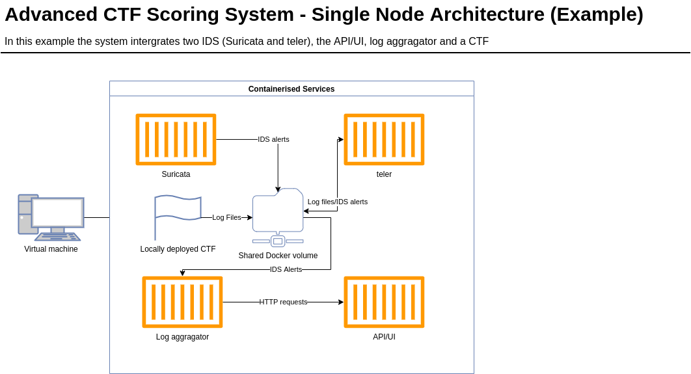
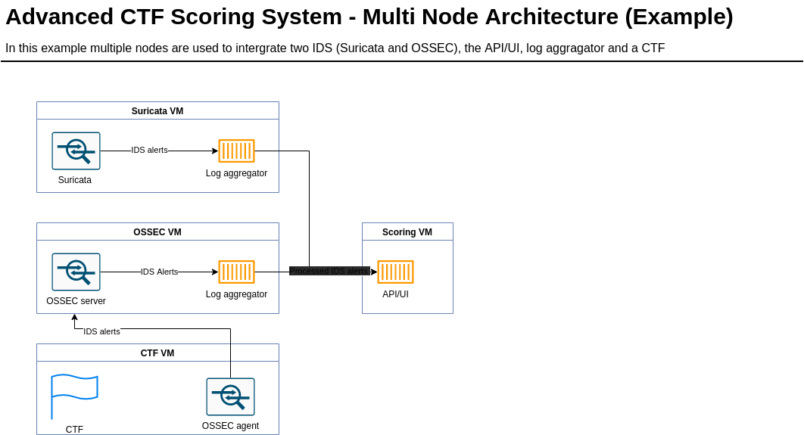

# Advanced CTF Scoring System

## Overview

## Deployment Options

### Single Node Deployments

The single-node deployment pattern is probably the most straightforward and least computationally intensive option. In this deployment, all the individual components are hosted on one system. If the provided docker containers are used this looks like something like this:



This deployment option is the least secure as the entire scoring system is running on top of a vulnerable CTF. This almost guarantees that it will be compromised during the course of a CTF. As a result, this deployment option should only be used when CTF participants are given their target nodes and are unable to interact with others. As the validity of both scores and accounts cannot be verified in a single-node deployment. It is possible to deploy this system without the use of containers. However, it is recommended that containers are used and given their own static IPs in the container network if multiple services are deployed. This will allow the system to easily filter and apply events. The demo CTF uses this methodology, the docker-compose file for it is available for reference [here](https://github.com/Jroo1053/CTFScore/blob/master/Deployment/Ansible/roles/democtf/files/wazuh-docker/docker-compose.yml)

An Ansible playbook for deploying an example CTF in single-node "mode" is available [here](https://github.com/Jroo1053/CTFScore/tree/master/Deployment/Ansible/roles/democtf)
### Multi Node Deployments

The multi-node deployment is more complex and computationally intensive but, is better suited to handling multi-user CTF. In this deployment all of the resources are deployed on their own VMs with, all of the CTF targets remaining separate from the scoring system:



This 
## Installation options

### Automated CTF Deployment

The installation and configuration of every system component is pretty time-consuming. Therefore, it is recommended that the ansible playbooks provided in the ```Deployment``` section of this repo are used for most deployments. There are roles are currently available for:

1. The log aggregator
2. The API/UI
3. Suricata 

Each of the roles in the ```Deployment```is separate so you can use a combination of them to build for any particular deployment. Note, that this deployment option still requires some configuration and should be completed by modifying each of the roles ```vars/main.yml``` file.

### Log Aggregator Installation

The Log aggregator is a simple python application so, the usual steps apply; First grab this repo with ```git clone```, Navigate to the source files at ```/Source/logger.py``` and ```Source/Lib```, then install the required dependencies by running ```pip install -r logger_reqs.txt```. If the dependency installation completes successfully it should then be possible to run the log aggregator in a specified config file (```python3 /Source/logger.py -c config.yml```).

It is also recommended that the log aggregator is run under ```systemd```, so it can run silently and resume after failure, an example service file is available [here]().

### Log Aggregator Configuration

The log aggregator requires some configuration once the installation is complete. This configuration can only be applied through a YAML config file, consisting of two primary sections. The ```global_options``` section contains settings that affect the overall behaviour of the programme and is detailed below:

```yaml
---
# ALl keys in this section are mandatory
global_options:
    # The base url of the API that will receive the IDS alerts
    api_url: http://localhost:5000/api
    # How long to wait (in ms) between reading and forwarding alerts to the api
    polling_rate: 250
    # Paths for the API Key and ID files. These must match the values set in
    # the api. 
    # The ID cannot be more than 128 chars long. The Key cannot longer 
    # than 256.
    api_key_file: Source/Logging/test_key.txt
    api_id_file: Source/Logging/test_id.txt
    ssl_cert_file: /etc/ctfscore/cert
    # Final paths to different API calls used by the aggregator.
    # These are added to the base url as defined by api_url
    api_status_endpoint: "/status"
    api_forward_event_endpoint: "/events"
    # The maximum number of **consecutive** failures since the last successful
    # interaction with the api.
    api_max_retries: 5
    # It can be useful to disable the API forwarding function when developing the log aggregator
    api_is_enabled: True
```

The ```ids_options``` section of the config file is also mandatory and is used to define the details of the IDS(s) to be targetted by the log aggregator. This section is detailed below:

```yaml
# This section is mandatory. There are set no limits on the number of 
# IDS provided that there is at least one **VALID** IDS.
ids_options:
  - ids:
      # This section is used to define the json keys that the 
      # selected IDS uses to store the information about each alert.
      # Note, that these must be set using the json pointer format 
      # Additional documentation on the exact keys used by all of 
      # the supported IDS is available at
      log_file_format:
        fields:
          timestamp: /timestamp
          src_ip: /src_ip
          dest_ip: /dest_ip
          message: /alert/signature
          category: /alert/category
          # The severity field is the only optional field.
          # alerts without a severity will not be counted by the scoring
          # algorithm howerver, they will still be displayed in the UI.
          severity: /alert/severity
        path: Source/Test/Files/bigeve.json
      # The maximum number of **VALID** alerts to forward during every 
      # event loop tick. This can be set to a high value (>200) depending 
      # on the IDS config but, exceedingly high values
      # Will result in the event loop slowing too much.
      max_alerts: 100
      # The name of the IDS, this value is displayed to the user in many
      # of the screens in the API/UI
      # This is also used to prompt the aggregator to run additional 
      # parsing steps for certain IDS.
      name: "Suricata"
      # This value is meant to represent the false-positive rate of the 
      # IDS and should be set between 0-10.
      # The scoring algorithm will take this value into account so that
      # alerts from "noisy" IDS are treated as less important than
      # reliable IDS
      reliability: 5
  - ids:
      log_file_format:
        fields:
          timestamp: /timestamp
          severity: /rule/level
          message: /rule/description
          src_ip: /data/srcip
          dest_ip: /agent/name
          category: /rule/groups/0
        path: Source/Test/Files/wazuh.json
      max_alerts: 100
      reliability: 8
      name: "Wazuh"
```

When complete the config file can be applied to the log aggregator using the ```-c``` flag. Note, that the log aggregator will also attempt to load from the following path ```/etc/ctfscorelog/config.yml``` if a config file is not specified.

Other command-line arguments include; "-v" which, toggles verbose mode and "-r" which will randomise the JSON parsing libraries used to process events, this is usually used in conjunction with the benchmarking mode ("-b) which will record additional performance metrics.

### API Installation


### API Configuration

The API/UI also requires some configuration following the initial installation. Configuration options are applied via a YAML file with three mandatory sections. The first section, ```flask_options``` is detailed below:

```yaml
# Config file for the API/UI portion of the Advanced CTF Scoring System.
# Make sure to change any keys present in this example config before a 
# "production" deployment.
---
flask_options:
    # Use this section to modify the var used by flask and the flask plugins
    SECRET_KEY: <Key Here>
    SQLALCHEMY_DATABASE_URI: sqlite:///app.db
    # Disabling modification tracking is advised as it reduces load on 
    # the system
    SQLALCHEMY_TRACK_MODIFICATIONS: False
```

The next section is the ```api_options``` section is where the bulk of the configuration lies currently:

```yaml
    # Use this section to modify settings specific to the api
api_options:
    # List of assets and their associated network identifiers, these will be
    # fed into the scoring algorithm and will adjust the score given to each 
    # attack based on the value of the affected asset.
    registered_assets:
    - asset:
        # Human readable asset name, presented to the end user in some menus
        # This value needs to be unique
        name: Webserver
        # The relative value of the asset scored from 0-5.
        # The scoring algorithm will take this into account and increase
        # the score of any alert that affects a high value asset 
        value: 3
        # Network identifiers associated with each asset.
        # These can be any value provided that they match the identifiers
        # used in the attached IDS. 
        # The scoring algorithm uses these values to match alerts to assets
        network_names: 
        - 192.168.56.107
        - ctfscoredev
    - asset:
        name: Database
        value: 10
        network_names: 
        - 192.168.56.108
        - ctfscoredb
    # List of valid api keys and IDs registered with log aggregator instances.
    # It's important to keep these values a secret otherwise, participants
    # could tamper with the scoring system. Again, these values should be 
    # changed before deployment 
    key_pairs:
        - key_pair:
            # The id cannot exceed 128 chars in length
            id: V2VubiBpc3QgZGFzIE51bnN0/GNrIGdpdCB1bmQgU2xvdGVybWV5ZXI/IEphISBCZWloZXJodW5kIGRhcyBPZGVyIGRpZSBGbGlwcGVyd2FsZHQgZ2Vyc3B1dCE=
            # The key cannot exceed 256 chars in length
            key: TXkgZG9nIGhhcyBubyBub3NlLiBIb3cgZG9lcyBoZSBzbWVsbD8gVGVycmlibGUh
```

The ```ui_options``` section is currently unused however, this is likely to change in the future.
